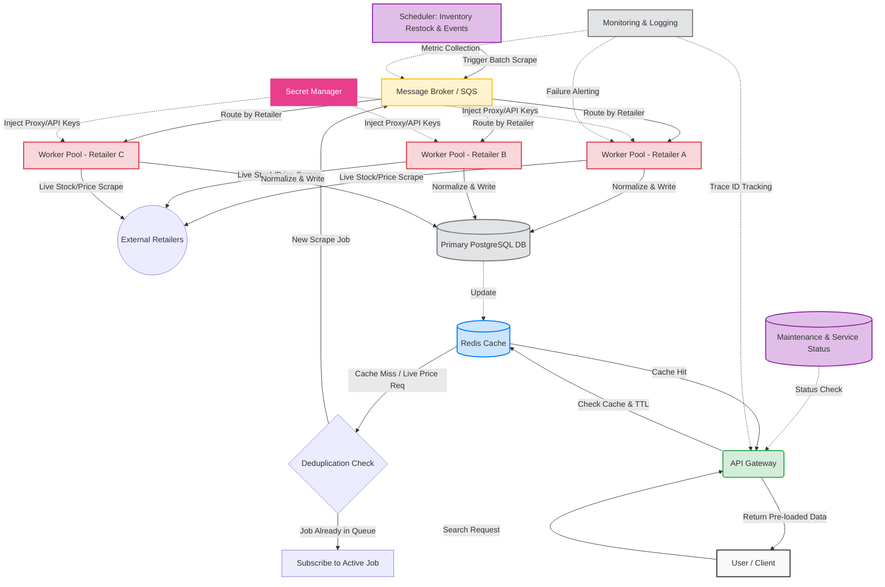

Pre-loaded vs On Demand Data: The parts which pre-loaded as a batch include inventory and scheduled events. Given that new stock comes in on a schedule and not randomly,
it would be appropriate for this information to be stored in batch memory. Along with this, scheduled events such as downtime and maintenance for the service would also be 
pre-loaded data too. On-demand data is different, and information such as live stock (ie. how many the retailer has in possession at the moment) as well as the price of goods 
are amongst the items that should be provided on demand. These two data strategies are depicted in the diagram above by isolating the Proactive Flow from the Reactive Flow. 
The former represents pre-loaded information, whereas the latter represents On-Demand Data.

Queueing / orchestration approach: In the diagram above, queueing is represented by the Message Broker node. The Message broker connects the API which the user interacts with
to backend pools; this is particularly important in ensuring that longer and more arduous scraping requests do not "block" the user from conducting more searches. By using a 
Message Broker in particular, we can ensure that systems can run independently, so that if a component fails or is overwhelmed, data is not lost. The deduplication node is where
it is so that if an identical search for the same retailer is already in the queue, the new user's request "subscribes" to that existing job. Also in the diagram is the routing logic, 
which basically retries strategies should they fail (ie. if it fails with one retailer, it tries it with another).

Secret and credential management strategy: In the diagram above, the secret and credential management strategy is represented by 
